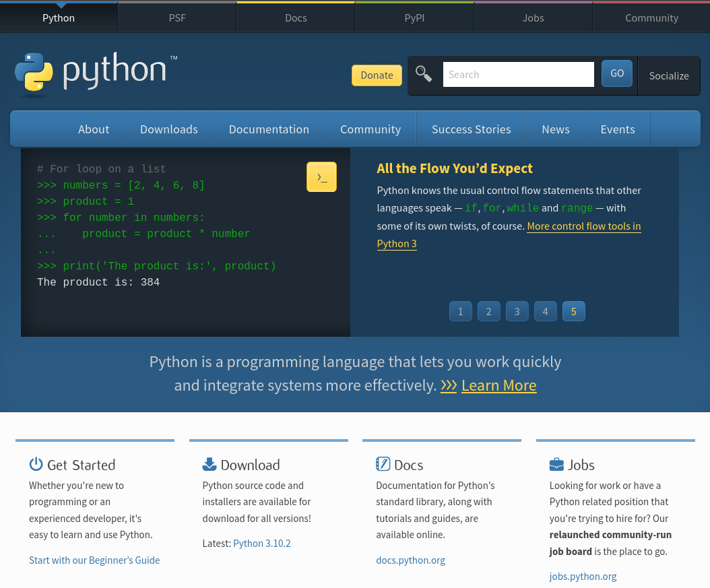
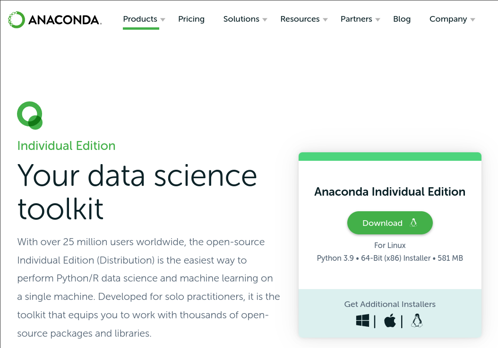
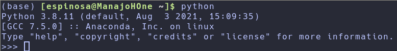

# Introducción

**Python** es un lenguaje de programación de alto nivel de propósito general. Es *open source*, *interpretado* y *orientado a objetos*. Python fue creado por *Guido van Rossum*, un programador neerlandés (Países Bajos). El nombre de Python está inspirado en la serie de comedia británica *Month Python's Flying Circus*. La primera versión fue publicada el 20 de Febrero de 1991.

## Por qué Python?

Python fue concebido como un lenguaje de programación que fuera sencillo de entender, y por lo tanto, fácil de aprender y usar. Python es usado en varias industrias y compañias (como Google). Se usa para el desarrollo de aplicaciones web, aplicaciones de escritorio, administración de sistemas y librerias de *machine learning*. Python es un lenguaje que ha sido adoptado para el desarrollo en la ciencia de datos y machine learning.

# Cómo usar Python?

## Instalando Python

### Página Oficial

Para programar en Python (ya sea por comandos o correr un *script*) se necesita un **intérprete** de Python. Podemos entrar a la [página oficial](https://www.python.org/). Lo primero que encontrarán será:



Se van a la sección de Descargas (Downloads):


Descargan el archivo correspondiente a su sistema operativo y la instalan.

### **All-Distributions**

A pesar de que en la página oficial de Python se encuentra el interprete más actualizado, hay que instalar manualmente los paquetes que queramos usar. Existen *paquetes* que contienen todos los paquetes necesarios para trabajar, entre ellos está el distribuido por **Anaconda**. En la (página oficial)[https://www.anaconda.com/] pueden encontrar el instalar correspondiente a su sistema operativo.


En la sección de Productos pueden encontrar las distintas distribuciones que existen, en este caso nos interesa la edición individual.



Igualmente, descargan la versión correspondiente a su sistema operativo y la instalan.

Se recomienda usar la versión de anaconda porque ya tendrán instalados todos los paquetes necesarios para hacer computo científico.

## El interprete de Python

El **interprete** de python es el encargado de ejecutar las instrucciones/comandos que uno quiera. De cualquier manera que uno trabaje con Python, siempre se tendrá que conectar con el interprete de alguna manera.

Generalmente podemos correr un interprete si corremos el siguiente comando en una terminal:

```shell
python
```

Podemos ver que, independientemente de la forma de instalar Python, se obtienen resultadosimilares:



Como podemos ver en la terminal, nos indica que versión de Python está corriendo el interprete abierto. Las versiones de python pueden ser diferentes al diferir la fecha de instalación. Si todo lo anterior corre, significa que ya tienen Python instalado.

Para salir propiamiente del interprete escribir el comando:

```python
quit()
```

O tambien con el comando:

```python
exit()
```

Pueden revisar la versión de python que tienen instalado sin entrar al interprete, solamente tienen que correr el comando:

```shell
python --version
```

## El shell de python

Python es un lenguaje **interpretado**, eso quiere decir que no necesita ser *compilado*. Esto significa que se ejecuta linea por linea. Cuando uno abre un interprete de Python, realmente estamos abriendo el *Python Shell* (*Python Interactive Shell*), el cual será usado para ejecutar los comandos de python.

Python Shell esperara a que el usuario le pase código de python. Cuando uno se lo pasa, este lo interpreta y muestra el resultado en la siguiente línea. En una terminal, ejecutemos el Python Shell con:

```shell
python
```


El shell interactivo de Python se abre y espera a que escribamos algun código de Python (**Python script**). Las instrucciones que nosotros escribamos serán puestas despues del símbolo >>>. Una vez que esté lista la instrucción habrá que pulsar Enter. Escribamos lo siguiente:

```python
2 + 3
```

Si la instrucción esta bien, el interprete lo ejecutará sin problemas, en caso contrario, el interprete nos regresará un error. Veamos como se ve un error:

```python
2 x 3
```

Como podemos ver, el interprete nos ha regresado un error. Python nos indicará cual es el error, en este caso será: *SyntaxError: invalid syntax*. En este caso, el error fue usar x como símbolo de multiplicación, ya que el símbolo para realizar una multiplicación es un asterisco (*). Esta claro que la información que nos ha dado el interprete muestra claramente donde está el error y como arreglarlo.

Este proceso de identificar y solucionar errores de un programa se llama *debugging*. Por lo tanto, vamos a *debuggear* este error poniendo el siguiente código:

```python
2 * 3
```

Con el error arreglado, veremos que el código corre sin problema. 

Al programar, será habitual que veamos este tipo de errores con cierta frecuencia. *Debuggear* es algo que se aprende con la práctica, aunque hay ciertos lineamientos que pueden ser útiles. Igualmente hay herramientas que nos pueden ayudar a realizar este proceso más rápido y eficientemente. Algo que puede ayudar es saber que tipo de errores existen. Algunos de los errores que podrán encontrar en Python son: *SyntaxError*, *IndexError*, *NameError*, *ModuleNotFoundError*, *KeyError*, *ImportError*, *AttributeError*, *TypeError*, *ValueError*, *ZeroDivisionError*, etc. Durante este curso veremos algunos de estos errores.

Hagamos unas operaciones básicas en el interprete. Realicemos las siguientes operaciones

> 2 + 3
>
> 3 - 2
>
> 3 * 2
>
> 3 / 2
>
> 3 ^ 2

Ademas en Python podemos encontrar las siguientes operaciones

> 3 % 2: Operación Módulo
>
> 11 // 3: Operación *Floor division*

Escribamos estas operaciones en el shell de Python. Ademas agreguemos un comentario delante de ellas para describir que estan haciendo.

Los comentarios son partes de código que no se ejecutarán, su uso es meramente descriptivo. Esto hará que podamos describir al código y sea mas entendible. Un comentario en python inicia con el símbolo *hash* (#)

```python
# Esto es un comentario
# Esto es un comentario mas largo
```

Probemos algunas más cosas en el interprete. Si se desea poner una palabra o texto en python, este tendrá que ser puesto entre apóstrofes o comillas. A este tipo de dato se les llama *strings* las cuales serán estudiadas más adelante.

```python
'Palabra uno' # Texto entre apostrofes
"Palabra dos" # Texto entre comillas
```

Si el texto es muy largo, podemos usar tres apóstrofes en lugar de uno:

```python
'''Esto es un texto muy muy muy muy muy muy muy muy muy muy muy muy muy largo'''
```

Recordar que para salir del interprete pueden usar el comando:

```python
exit()
```

## Scripts y editores

El shell interactivo de Python es realmente útil para probar códigos pequeños, pero no es recomendable cuando se tiene un proyecto muy grande. En un ambiente real de trabajo los desarrolladores usan *editores de código* especializados para escribir sus códigos.

Podemos hacer la clasificación entre dos diferentes editores de código:

1. IDEs (Integrated Development Environment)
2. Editores de texto

### IDEs

Como su nombre indica, son editores altamente especializados en la producción de código a
gran escala. Hay varios bastante populares y otros que son básicos. Entre los más populares están:

1. [Visual Studio](https://code.visualstudio.com/)
2. [PyCharm](https://www.jetbrains.com/pycharm/)
3. [Spyder](https://www.spyder-ide.org/)

A pesar de que cada uno tiene sus propias características, todos tienen un editor de texto, con el cual se puede editar los *scripts*. Además tambien tienen un interprete de python listo para ejecutar el script.

Un script es un programa o secuencia de instrucción que es interpretado o ejecutado por otro programa en lugar del procesador de la computadora. Su finalidad es guardar las instrucciones para ser ejecutadas posteriormente.

En general, los lenguajes de scripts son más fáciles y rápidos de hacer que los lenguajes compilados. Sin embargo, un script tomará mucho más tiempo en ejecutarse que un programa compilado dado que cada instrucción tiene que ser procesado por otro programa antes de ser ejecutado por el procesador.

Son libres de usar el que consideren mejor o que se ajuste a sus necesidades, pero no son indispensables.

### Editores de texto/código

A pesar de que un IDE pareciera ser la opcíon ideal para desarrollar programas, su núcleo es un editor de texto y su conexión a un interprete. Muchos usuarios prefieren usar un editor de texto y ellos mismos ejecutarlo en un interprete de python. Puede ser difícil de comprender como se pudiera preferir un editor de texto sobre un IDE, pero se debe de tomar en cuenta los siguientes puntos:

1. Los editores de texto son mucho mas ligeros que un IDE
2. Muchos editores de texto pueden ser configurados para igualar o superar las caracteristicas de un IDE.
3. **No** cambia esencialmente nada en el desarrollo de los programas

Claro que hay puntos negativos, entre los que se encuentra el más importante, estos editores de texto pueden tener una curva de aprendizaje bastante larga.

Algunos de los editores de texto más populares son:

1. [Atom](https://atom.io/)
2. [SublimeText](https://www.sublimetext.com/)
3. [Notepad++](https://notepad-plus-plus.org/)
4. [Vi/Vim](https://www.vim.org/)
5. [Emacs](https://www.gnu.org/software/emacs/)

Es meramente una cuestion personal usar un IDE o un editor de texto y no debería de importar si el usuario se siente cómodo usando la herramienta de su preferencia si no afecta en el desarrollo de software.

# Python Básico

## Archivos asociados a un script de Python

Un script de Python puede ser escrito en el shell Interactivo de Python o en un editor de código/texto. Se distingo con una *extensión* .py a aquellos scripts de Python.

## Indentación en Python

Las indentaciones es una parte fundamental en el lenguaje de Python. Una indentación es un espacio blanco en un texto. En diversos lenguajes de programación es usado para mejorar el aspecto del código, sin embargo en Python se usa para crear bloques de código. Son similares a las llaves({}) en lenguajes como C. Uno de los errores más comunes cuando se escribe un código en Python es una mala indentación.

Problemos el siguiente código:

```python
2 + 3
```

Es ejecutado sin problemas, que pasa si agregamos un espacio al inicio

```python
 2 + 3
```

Es devuelto un error de indentación, *IndentationError*. Esto muestra lo importante que son las indentaciones dentro del lenguaje Python. Mas adelante veremos como se usan dentro de los scripts.

## Comentarios

Los comentarios son muy importantes al hacer programas. Nos proporcionan la capacidad de dejar descripciones, marcas, ayudas, etc. Los comentarios no se ejecutaran por el interprete de Python. Los comentarios comienzan con el símbolo de hash (#).

Los comentarios de una sola línea se ven de la siguiente manera:

```python
# Comentario 1
# Comentario 2
# Comentario 3
```

Puede haber comentarios multilínea, en este tipo de comentarios se usan triples comillas:

```python
""" Este es un comentario
multilinea. Puede contener
multiples lineas
"""
```

## Tipos de datos

En Python hay diferentes tipos de datos. Empezaremos con los más comunes, sin embargo, podemos transformar de un tipo de dato a otro.

### Números

- Enteros: Llamados integers, cubre el conjunto de números enteros.
- Flotados: Son los números decimales, es decir, cubre el conjunto de números reales
- Complejos: Abarcan el conjunto de los complejos. La parte imaginaria se denota con 
**j**.

### Strings

Es una colección de uno o más caracteres denotados con una comilla simple o doble comilla. Si la string incluye más de una oración, se usa triple comilla.

```python
'Carlos'
"Es un curso de python"
```

### Booleanos

Un booleano es un tipo de dato que solo puede tomar dos valores: verdadero (True) o falso (False).

```python
True
False
```

### Lista

Una lista en python es una colección ordenada que nos permite guardar diferentes tipos de dato en ella. Las listas de python son similares a un arreglo en JavaScript.

```python
[0, 1, 2, 3, 4, 5]
['Naranja', 'Pera', 'Manzana']
['Platano', 1, False, 9.81]
```

### Dicccionario

Un diccionario en python es una colección no ordenada de datos con un identificador.

```python
{
'nombre': 'Carlos',
'apellido': 'Espinosa'
'pais': 'Mexico',
'estado': 'Ciudad de Mexico'
}
```

### Tupla

Una tupla es una colección ordenada de diferentes tipos de datos como las listas, pero las tuplas no pueden ser modificadas una vez creadas, es decir, son **inmutables**.

```python
('Carlos', 'Alejandra', 'Martín', 'Karla', 'Juan')
```

### Conjuntos

Un conjunto es una colección de datos. A diferencia de las listas y tuplas, los conjuntos no es una colección ordenada. Además, los conjuntos solo guardan elementos únicos/

```python
{2, 3, 4, 5}
{3.14, 9.81, 2.7}
```

## Revisar el tipo de dato

Para revisar que tipo de dato es un dato o una variable, usaremos la función **type**. En la terminal revisemos los tipos de datos de los ejemplos anteriores.

```python
type(10)
```

## Archivos de python

Debemos de tomar en cuenta que cuando uno trabaja con el shell interactivo de Python, este imprime los mensajes automáticamente bajo ciertas circunstancias. Pero cuando uno usa un script, hay que escribir explícitamente que resultado queremos ver. Para esta tarea usaremos la función **print()**. Esta función puede tomar más de un argumento.

Hagamos un archivo con terminación .py y escribamos lo siguiente:

```python
print(2 + 3) 
print(3 - 1)
print(2 * 3) 
print(3 / 2) 
print(3 ** 2) 
print(3 % 2) 
print(3 // 2) 
```

Veamos que pasa si queremos saber el tipo de algunas variables

```python
print(type(10))
print(type(3.14))
print(type(1 + 3j))
print(type('Carlos'))
print(type([1, 2, 3]))
print(type({'nombre':'Carlos'}))
print(type({9.8, 3.14, 2.7}))
print(type((9.8, 3.14, 2.7)))
```

Nótese el uso de la función print para imprimir el resultado de la función type

## Notebooks

Como se mencionó al inicio, lo único que se necesita es un interprete de python para poder trabajar con python. Por lo que se han desarrollado los *notebooks* de python que nos permiten agregar ciertas funcionalidades para prsentar trabajos.

Hay dos herramientas muy útiles para hacer notebooks:

- [Jupyter Notebook](https://jupyter.org/)
- [Google Colab](https://colab.research.google.com/)

Los notebooks son visualizados con un explorador web en donde podemos correr código y obtener sus resultados y agregar texto con cierto formato. Esto es posible por que se corre un interprete de python en *background* donde se corren los comandos, mientras que en el *servidor* web se corren los comandos de texto.

Esta manera de trabajar es bastante buena para mostrar resultados, exposiciones, guardar resultados (dado que los notebooks guardan el resultado de los comandos). Es una herramienta didáctica bastante buena, sobretodo para guardar los resultados y poder visualizarlos rápidamente. Sin embargo, a nivel de producción de software puede resultar ineficiente.
