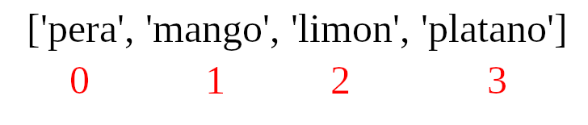
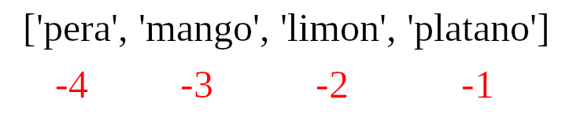

# Listas

En python, podemos encontrar cuatro tipos de colecciones de elementos:

- `list`: Es una colección de elementos ordenados y modificables. Se permiten los elementos repetidos.
- `tuple`: Es una colección de elementos ordenados y no modificables. Permite elementos repetidos.
- `set`:  Es una colección de elementos no ordenados, no *indexados* y no modificable. Pero se pueden agregar nuevos elementos al conjunto. No se permiten los elementos repetidos.
- `dictionary`: Es una colección de elementos no ordenados, modificable e *indexados*. No permite elementos duplicados.

El primer conjunto que veremos serán las **listas**. Las listas es una colección de elementos de diferentes tipos de datos. Los elementos están ordenados y son *mutables*. Una lista puede ser vacía.

## Como crear una lista

En python podemos crear una lista de dos maneras:

- Usando la función `list()`

```python
lista = list()     # crea una lista vacia
print(len(lista))
```

- Usando corchetes `[]`

```python
lista2 = []        # Crea una lista vacia
print(len(lista2))
```

Podemos definir listas con elementos y usar `len()` para saber su tamaño
```python
frutas = ['mango', 'naranja', 'limon',' platano']
verduras = ['papa', 'tomate', 'cebolla', 'zanahoria']
lenguajes = ['java', 'python','c','ruby','julia']

print('Frutas:', frutas)
print('verduras:', verduras)
print('Lenguajes de Programacion:', lenguajes)
print('Numero de frutas:', len(frutas))
print(f'Numero de verduras: {len(verduras)}')
print('Numero de lenguajes de programacion: {}'.format(len(lenguajes)))
```

Los elementos de las listas pueden ser de diferentes tipos:

```python
lista = ['Carlos', 'Espinosa', 1989, True, ['Licenciatura', 'Maestria']]
```

## Accediendo a los elementos de una lista por su índice

Al igual que las `strings`, los elementos de una lista se les asigna un ID dentro de la lista (por esto son ordenadas). Este índice **siempre inicia en 0**.



```python
frutas = ['pera', 'mango', 'limon', 'platano']
primer_fruta = frutas[0]
print(primer_fruta)
segunda_fruta = frutas[1]
print(segunda_fruta)
ultima_fruta = frutas[3]
print(ultima_fruta)
# Ultimo indice
ultimo_indice = len(frutas) - 1
ultima_fruta2 = fruta[ultimo_indice]
print(ultima_fruta2)
```

## Usando índices negativos

Los índices negativos significan empezar a contar de derecha a izquierda, donde el primer elemento de la derecha tienen como índice `-1` y el segundo tiene el índice `-2`.



```python
frutas = ['pera', 'mango', 'limon', 'platano']
primer_fruta = frutas[-4]
ultima_fruta = frutas[-1]
penultima_fruta = frutas[-2]
```

## *Desempaquetando* los elementos de una lista

```python
lista = ['ele1', 'ele2', 'ele3', 'ele4', 'ele5', 'ele6']
elemento1, elemento2, elemento3, *los_demas = lista
print(elemento1)
print(elemento2)
print(elemento3)
print(los_demas)
```

```python
# Ejemplo 1
frutas = ['manzana', 'lima','limon', 'naranja', 'mango', 'platano']
fruta1, fruta2, fruta3, *el_resto = lista
print(fruta1)
print(fruta2)
print(fruta3)
print(el_resto)

# Ejemplo 2
primero, segundo, tercero, *otros, decimo = [1, 2, 3, 4, 5, 6, 7, 8 , 9, 10]
print(primero)
print(segundo)
print(tercero)
print(otros)
print(decimo)

#Ejemplo 3

paises = ['Alemania', 'Francia', 'Belgica', 'Suiza', 'Dinamarca', 'Finlandia', 'Noruega', 'Islandia', 'Estonia']
ale, fr, bg, sz, *escandinavos, es = paises 
print(ale)
print(fr)
print(bg)
print(sz)
print(escandinavos)
print(es)
```

## Manipulando listas por sus índices

Podemos especificar el rango de elementos deseados usando índices positivos. Para esto tenemos que especificar el inicio, el final y el *tamaño del paso*. Esto nos regresará una lista nueva con los elementos deseados.

```python
frutas = ['manzana', 'lima','limon', 'naranja', 'mango', 'platano']
todas_frutas = frutas[0:6]
todas_frutas2 = frutas[0:]
lima_limon = frutas[1:3]
lima_limon_naranja = frutas[1:4]
lia_naranja_platano = frutas[::2]
```

También podemos usar índices negativos para obtener los elementos requeridos.

```python
frutas = ['manzana', 'lima','limon', 'naranja', 'mango', 'platano']
todas_frutas3 = frutas[-6:]
lima_limon = frutas[-5:-3]
lima_limon_naranja = frutas[-5:-2]
frutas_invertido = frutas[::-1]
```

## Modificando listas

Una lista es una colección modificable o **mutable** de elementos.

```python
frutas = ['manzana', 'lima','limon', 'naranja', 'mango', 'platano']
frutas[0] = 'aguacate'
print(frutas)
frutas[1] = 'manzana'
print(frutas)
frutas[-1] = 'lima'
print(frutas)
```

## Revisando si un elemento está en la lista

Podemos revisar si cierto elemento está en la lista usando el operador `in`.

```python
frutas = ['manzana', 'lima','limon', 'naranja', 'mango', 'platano']
print('lima' in frutas)
print('aguacate' in frutas)
```

## Agregando elementos a una lista

Podemos agregar elementos al final de una lista usando el *método* `append()`

```python
frutas = ['manzana', 'lima','limon', 'naranja', 'mango', 'platano']
frutas.append('aguacate')
print(frutas)
frutas.append('pera')
print(frutas)
```

## Insertando elementos a una lista

Podemos insertar un elemento a una lista por medio del *método* `instert()`. Para esto tenemos que especificar la posición en la cual queremos insertarlo, es decir, tenemos que especificar el índice.

```python
frutas = ['manzana', 'lima','limon', 'naranja', 'mango', 'platano']
frutas.insert(2, 'aguacate')
print(frutas)
frutas.insert(3, 'pera')
print(frutas)
```