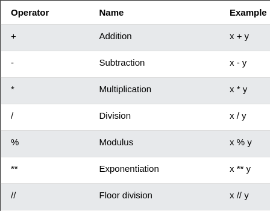
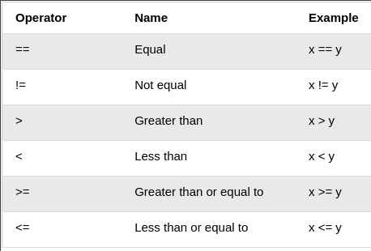

# Booleanos

Los datos del tipo booleano solo pueden tomar dos valores `True` y `False`. Este tipo de dato será muy importante cuando se usen los *operadores* de comparasión. Las primeras letras, T y F, siempre son mayúsculas.

```python
print(True)
print(False)
```

# Operadores

Python soporta varios tipos de operadores. En esta sección nos enfocaremos en algunos de ellos. En esta sección, las imagenes fueron extraídas de [W3Schools](https://www.w3schools.com/python/python_operators.asp).

## Operadores aritméticos

Los operadores aritméticos son los encargados para realizar las operaciones matemáticas.



## Operadores de asignación

Los operadores de asignación son usados para asignar valores a las variables.


Realicemos algunos ejemplos

```python
print('Suma', 1 + 2)
print('Resta', 2 - 1)
print('Multiplicacion', 2 * 3)
print('Division', 4 / 2)
print('Division', 6 / 2)
print('Division', 7 / 2)
print('Division entera', 7 // 2)
print('Division entera', 7 // 3)
print('Modulo', 3 % 2)
print('Potencias', 2 ** 3)
```

Declaremos algunas variables asignandoles un valor numérico:

```python
a = 7
b = 3

suma = a + b
resta = a - b
multi = a * b
division = a / b
res = a % b
floor = a // b
exponente = a ** b

print(suma)
print('a + b = ', suma)
print('a - b = ', resta)
print('a * b = ', multi)
print('a / b = ', division)
print('a % b = ', res)
print('a // b = ', floor)
print('a ** b = ', exponente)
```

Hagamos un programa en un editor de texto

## Operadores de comparasión

Los operadores de comparasión son usados para comparar dos valores.



